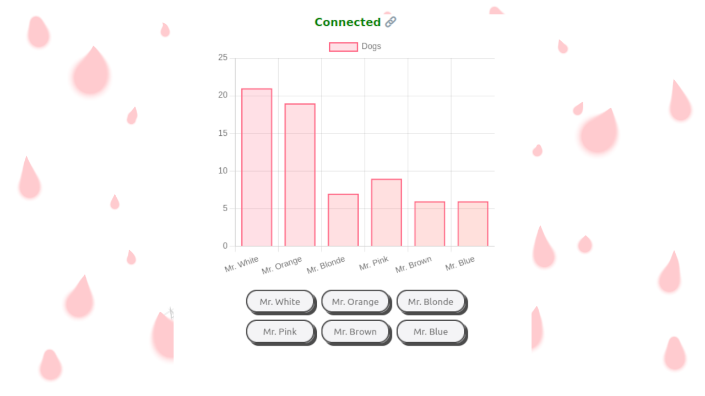

# 🗳️ NodeJs WebSocket Real Time Voting App

<!-- ## Background -->

> Super Simple JavaScript Websocket Realt Time Voting app.

### 📚 STACK
- NodeJs
- Html
- Css
- Javascript

## Installation

1. Clone the repo.
2. Install Packages.
> npm i
3. Run
> npm run start

## 🐛 Bugs

...sure

### Video Guide Link
    
[Video Guide](https://youtu.be/5VEbSbM5m3Q)

## License

Usage is provided under the MIT License. See [LICENSE](https://github.com/Yilber/readme-boilerplate/blob/master/LICENSE) for the full details.